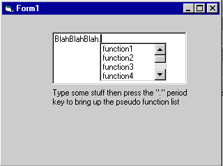



## IntelliSense Type Drop Down \( Position from Character \)

### Description

This is a quick and dirty example of how to add IntelliSense (like the VB IDE) type functionality to your apps.
 
### More Info
 

             |
---                |---
**Submitted On**   |2001-06-11 21:28:54
**By**             |[Grump\-pa](https://github.com/Planet-Source-Code/PSCIndex/blob/master/ByAuthor/grump-pa.md)
**Level**          |Intermediate
**User Rating**    |4.0 (8 globes from 2 users)
**Compatibility**  |VB 5\.0, VB 6\.0
**Category**       |[Custom Controls/ Forms/  Menus](https://github.com/Planet-Source-Code/PSCIndex/blob/master/ByCategory/custom-controls-forms-menus__1-4.md)
**World**          |[Visual Basic](https://github.com/Planet-Source-Code/PSCIndex/blob/master/ByWorld/visual-basic.md)
**Archive File**   |[IntelliSen210516112001\.zip](https://github.com/Planet-Source-Code/grump-pa-intellisense-type-drop-down-position-from-character__1-24013/archive/master.zip)

